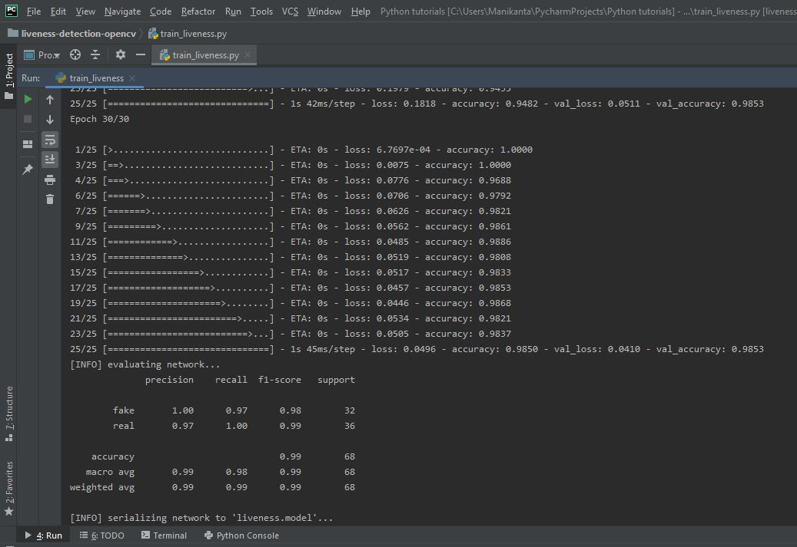
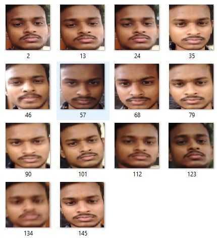
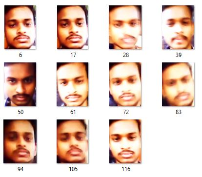
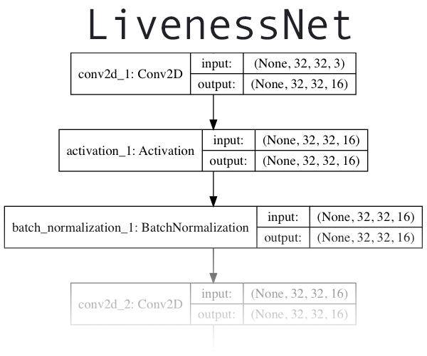

# TG hackathon 2
## training the liveness detection model
 

   
  

 

   
  

# Outputs of webcam stream - real(liveness) vs fake(pic,video)
## output1
 

   
  

  
## output2
 

   
  

  
 ## sample dataset for real(liveness)
 Obtained from video of myself.
 

   
  

  
## sample dataset  for fake(pic,video)
Video shooted while the orignal video playing on my laptop screen.
 

   
  

  
  # Theory
  In order to create the liveness detector, I’ll be training a deep neural network capable of distinguishing between real versus fake faces

1.Build the image dataset itself.

2.Implement a CNN capable of performing liveness detector.

3.Train the liveness detector network.

4.Create a Python + OpenCV script capable of taking our trained liveness detector model and apply it to real-time video.

I'll be treating liveness detection as a binary classification problem.

Given an input image, I’ll train a Convolutional Neural Network capable of distinguishing real faces from fake faces.

In order to build the liveness detection dataset:

I Took my Phone and put it in selfie mode. Recorded a ~12-second video of myself.
Replayed the same 12-second video, this time facing my Phone towards my laptop where I recorded the video replaying.
This resulted in two example videos, one for “real” faces and another for “fake” faces.
Finally, I applied face detection to both sets of videos to extract individual face ROIs for both classes.
## Python scripts description
### gather_examples.py :
This script grabs face ROIs from input video files, and generates the required dataset.
Real = 148 and Fake = 121;  Total = 269 faces.
### livenessnet.py
The next step is to implement “LivenessNet”, the deep learning-based liveness detector.

   
  

### train_liveness.py
This consists all the code required for training.
### liveness_demo.py
Access the webcam stream and apply face detection to each frame. For each face detected, apply the liveness detector model.
